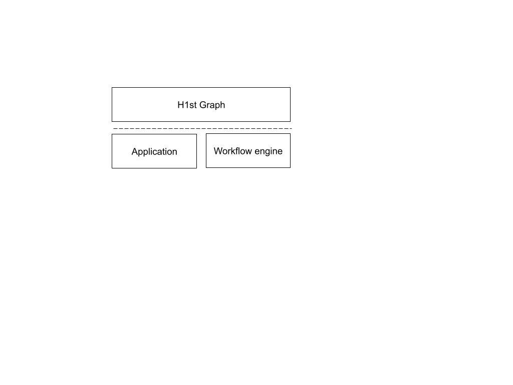

A h1st graph is a representation of execution flow similar to a flowchart. 
A h1st graph can be used at various stages of application lifecycle - data ingestion, data transformation, 
api definition, model training, etc. and requires execution capabilities. 

The graph definition and execution are separate so that the execution engine can be chosen without impacting user code.

