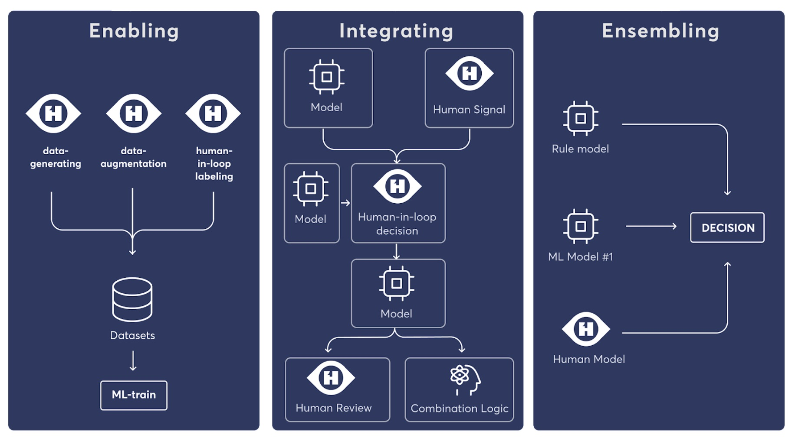

==================
Knowledge-First AI
==================

Why Knowledge-First
===================

An ML-only approach in the enterprise would fail to leverage human expertise wherever possible, sometimes even necessary. Knowledge-First AI embraces the codification and automation of knowledge and intelligence from any source, including and especially human knowledge and expertise.

This approach makes it possible to build and deploy AI systems even before there is sufficient data for machine learning. Across the industry, lack of data for machine learning is a widespread issue. It is important to be able (a) to leverage and automate human expertise that is already available, and (b) to combine it with machine-learned models as data and labels become more available over time.

Knowledge First AI aim to combines Human and Machine Intelligence in diverse ways.

Encoding Human Knowledge: The Oracle
====================================

Over the last decades, in each domain of industry, human experts have been playing a significant role in the operation of industrial companies. These experts have accumulated knowledge and know-how on a specific domain and can provide a foundation understanding to solve domain-specific problems.

However, human knowledge has its limit as it is hard to encode, store, and transfer within an organization. This is where machine learning has its advantage: generalization. But to build a machine learning model, sufficient data is needed.

**The Oracle** allows AI team to leverage expert knowledge already present in the organization and combine them with machine learning to scale up. This approach solves the fundamental problem for starting an AI project: insufficient data. Moreover, additional expert feedback can be used to improve AI performance.

**How it works**

  We started by capturing expert knowledge into what we call **The Teacher** - a model that encodes the expert rule in a specific domain. We will use **The Teacher** and unlabeled data to generate labeled data and to train **The Student** - an ML model that generalizes the expert rules. Finally, we will ensemble these prediction result into **The Oracle**. The diagram below shows the described technique.

  .. image:: h1st-oracle.jpg
    :width: 522px
    :align: center
    :alt: H1st Oracle Architecture

  In practice it is simple to create and use Oracle. Please refer to Quick-start guide for an example.

