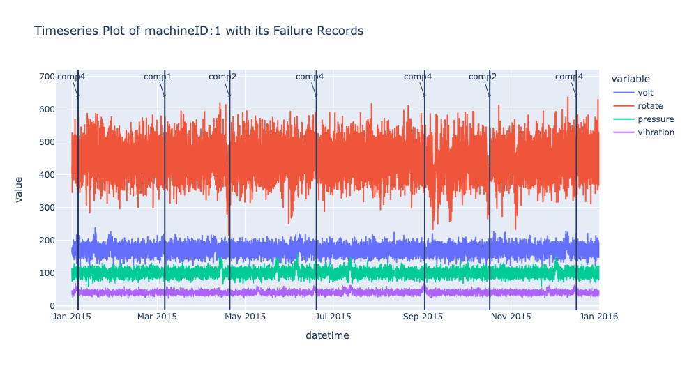
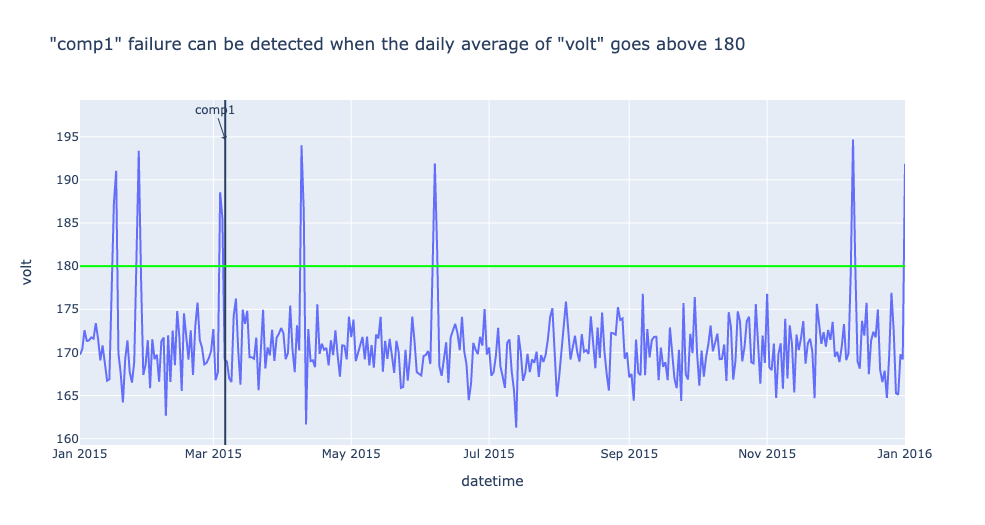
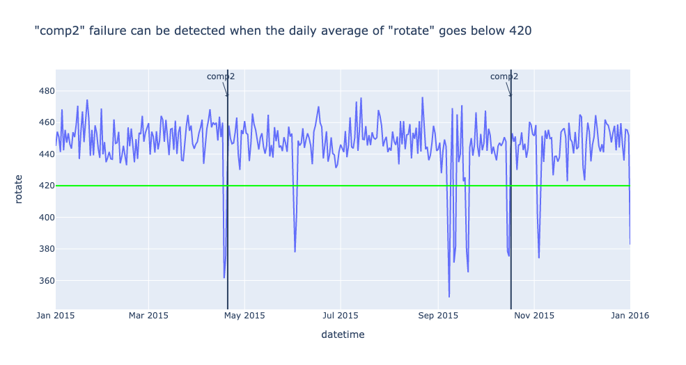
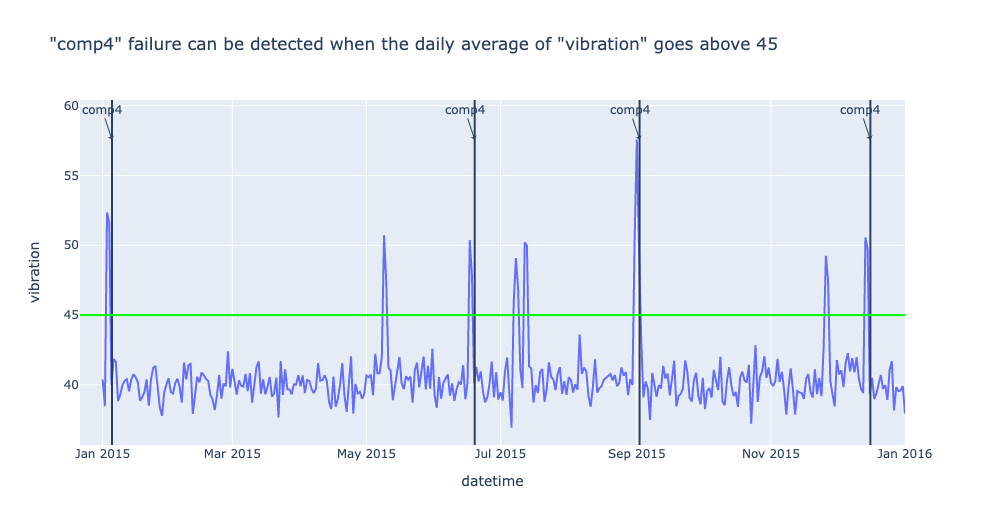
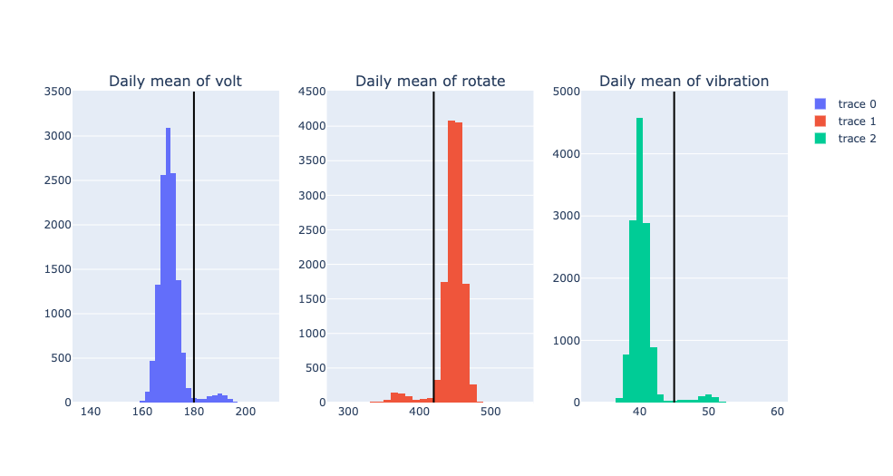

H1st Oracle: Combine Encoded Domain Knowledge with Machine Learning
====================================================================

In this tutorial, we will demonstrate the end-to-end process of building
Oracle, from raw data to Oracle model, using Microsoft Azure Predictive
Maintenance dataset. Through this tutorial, you will learn 1. how to
build rule-based model through data analysis 2. how to build Oracle from
this rule-based model and your unlabeled data. You can find the notebook 
version of this tutorial `here <https://github.com/h1st-ai/h1st/blob/main/user/tutorials/oracle/oracle_with_multivariate_timeseries_data.ipynb>`__. 

This tutorial has the following contents.

`1. H1st Oracle <#h1st-oracle>`__ - What is H1st Oracle? - Architeture
of Oracle

`2. Setup an Experiment <#experiment>`__ - Define the problem we solve
in this tutorial - Experiment Process

`3. Microsoft Azure Predictive Maintenance dataset <#dataset>`__ - Show
basic Exploratory Data Analysis (EDA) - Find some rules (patterns) that
can be used to predict faulty components of a machine

`4. Build a rule-based Model <#rule-based>`__ - Build a rule-based model
that can predict the faulty component of a machine - Evaluate the
performance of a rule-based model

`5. Build an Oracle using H1st.TimeSeriesOracle class <#oracle>`__ -
From a rule-based Fault Predictor, build an Oracle - Evaluate the
performance of Oracle and compare it with that of rule-based model

`6. Summary <#summary>`__

1. H1st Oracle
---------------

1.1 What is H1st Oracle ?
~~~~~~~~~~~~~~~~~~~~~~~~~~

Oracle is a special form of Knowledge-First AI in
`H1st <https://h1st.readthedocs.io/en/latest/README.html>`__. It helps
you combine your rule-based model with Machine Learning (ML) approach.
More specifically, from the rule-based model (Teacher) that you
provided, H1st Oracle autogenerates multiple ML Generalizers (Students)
and combine those Teacher and Students using Ensemble technique. Through
this Oracle approach, you can build ML models without using any labeled
data. Furthermore, your AI performance will keep improving as you
collect more data from a deployed AI system without updating your
existing rules (of course you can update and add more rules, but you
don’t need to). Lastly, if you already have some labeled data, you can
use them as well to build a more powerful Oracle.

1.2 Architeture of Oracle
~~~~~~~~~~~~~~~~~~~~~~~~~~

Oracle consists of one Teacher (RuleBasedModel), multiple Students 
(ML Generalizer), and one Ensemble. 

.. image:: h1st-oracle.jpg
    :width: 522px
    :align: center
    :alt: H1st Oracle Architecture

Additionally: 

\* To learn more about H1st framework, please visit `h1st.ai <https://h1st.readthedocs.io/en/latest/README.html>`__ 

\* You can also check out the `H1st API documentation <https://h1st.readthedocs.io/en/latest/api/README.html>`__

2. Setup an Experiment
-----------------------

2.1 Define the problem we solve in this tutorial
~~~~~~~~~~~~~~~~~~~~~~~~~~~~~~~~~~~~~~~~~~~~~~~~~

In this tutorial, we want to solve Predictive Maintenance problem.
Predictive Maintenacne is to help determine the codition of operating
equipments and proactively suggest when and what parts of equipment
require maintenance work. In this tutorial, we will narrow down the
problem and focus on identifying what part of equipment is going to fail
and, therefore, need to be replaced. We can go deeper into this problem
and differentiate “predicting the potential failure of component of not
yet failed machine” and “(postmortem) predicting a root cause component
of failed machine”. However, for simplicity, here we will consider them
as the same problem.

One important aspect of Oracle that we have emphasized is that we can
build Oracle without any labeled data. In this tutorial, we use labeled
data (machine failure records) only to create rules (patterns) for
detecting component failure. If we had domain knowledge on this
Microsoft Azure equipments, we wouldn’t have used any labeled data to
create rules.

2.2 Experiment Process
~~~~~~~~~~~~~~~~~~~~~~~

The experiment process will be like the following. 

-  Through data analysis, identify rules and build a rule-based model 
   that can classify faulty component of machine 

-  Split the entire dataset into training set and test set. 

-  Evaluate the rule-based model using test set. 

-  Build Oracle using the rule-based model and training set (without label) 

-  Evaluate the Oracle using test set. 

-  Compare the evaluation results of rule-based model and Oracle

3. Microsoft Azure Predictive Maintenance dataset
--------------------------------------------------

In this section, we will do basic Exploratory Data Analysis (EDA) to
find out some rules (patterns) that can be used to predict potentially
faulty components of a machine. We load the Microsoft Azure sample data
and create Pandas DataFrame objects for EDA.

Description of the dataset

We got the the following details of the dataset from
https://www.kaggle.com/arnabbiswas1/microsoft-azure-predictive-maintenance

-  Telemetry Time Series Data (PdM_telemetry.csv): It consists of hourly
   average of voltage, rotation, pressure, vibration collected from 100
   machines for the year 2015.

-  Error (PdM_errors.csv): These are errors encountered by the machines
   while in operating condition. Since, these errors don’t shut down the
   machines, these are not considered as failures. The error date and
   times are rounded to the closest hour since the telemetry data is
   collected at an hourly rate.

-  Maintenance (PdM_maint.csv): If a component of a machine is replaced,
   that is captured as a record in this table. Components are replaced
   under two situations: 1. During the regular scheduled visit, the
   technician replaced it (Proactive Maintenance) 2. A component breaks
   down and then the technician does an unscheduled maintenance to
   replace the component (Reactive Maintenance). This is considered as a
   failure and corresponding data is captured under Failures.
   Maintenance data has both 2014 and 2015 records. This data is rounded
   to the closest hour since the telemetry data is collected at an
   hourly rate.

-  Failures (PdM_failures.csv): Each record represents replacement of a
   component due to failure. This data is a subset of Maintenance data.
   This data is rounded to the closest hour since the telemetry data is
   collected at an hourly rate.

-  Metadata of Machines (PdM_Machines.csv): Model type & age of the
   Machines.

Acknowledgements

This dataset was available as a part of Azure AI Notebooks for
Predictive Maintenance. But as of 15th Oct, 2020 the notebook is no
longer available. However, the data can still be downloaded using the
following URLs:
https://azuremlsampleexperiments.blob.core.windows.net/datasets/PdM_telemetry.csv
https://azuremlsampleexperiments.blob.core.windows.net/datasets/PdM_errors.csv
https://azuremlsampleexperiments.blob.core.windows.net/datasets/PdM_maint.csv
https://azuremlsampleexperiments.blob.core.windows.net/datasets/PdM_failures.csv
https://azuremlsampleexperiments.blob.core.windows.net/datasets/PdM_machines.csv

3.1 Exploratory Data Analysis (EDA)
~~~~~~~~~~~~~~~~~~~~~~~~~~~~~~~~~~~~

.. code:: python

    import pandas as pd
    import plotly.express as px

.. code:: python

    data_basepath = 'https://azuremlsampleexperiments.blob.core.windows.net/datasets/'

.. code:: python

    df_telemetry = pd.read_csv(data_basepath + 'PdM_telemetry.csv')
    df_telemetry.shape

.. parsed-literal::

    (876100, 6)

.. code:: python

    df_telemetry.head()

.. raw:: html

    

    
    <table border="1" class="dataframe">
      <thead>
        <tr style="text-align: right;">
          <th></th>
          <th>datetime</th>
          <th>machineID</th>
          <th>volt</th>
          <th>rotate</th>
          <th>pressure</th>
          <th>vibration</th>
        </tr>
      </thead>
      <tbody>
        <tr>
          <th>0</th>
          <td>2015-01-01 06:00:00</td>
          <td>1</td>
          <td>176.217853</td>
          <td>418.504078</td>
          <td>113.077935</td>
          <td>45.087686</td>
        </tr>
        <tr>
          <th>1</th>
          <td>2015-01-01 07:00:00</td>
          <td>1</td>
          <td>162.879223</td>
          <td>402.747490</td>
          <td>95.460525</td>
          <td>43.413973</td>
        </tr>
        <tr>
          <th>2</th>
          <td>2015-01-01 08:00:00</td>
          <td>1</td>
          <td>170.989902</td>
          <td>527.349825</td>
          <td>75.237905</td>
          <td>34.178847</td>
        </tr>
        <tr>
          <th>3</th>
          <td>2015-01-01 09:00:00</td>
          <td>1</td>
          <td>162.462833</td>
          <td>346.149335</td>
          <td>109.248561</td>
          <td>41.122144</td>
        </tr>
        <tr>
          <th>4</th>
          <td>2015-01-01 10:00:00</td>
          <td>1</td>
          <td>157.610021</td>
          <td>435.376873</td>
          <td>111.886648</td>
          <td>25.990511</td>
        </tr>
      </tbody>
    </table>
    

.. code:: python

    df_machines = pd.read_csv(data_basepath + 'PdM_machines.csv')
    df_machines.shape        

.. parsed-literal::

    (100, 3)

.. code:: python

    df_machines.head()

.. raw:: html

    

    
    <table border="1" class="dataframe">
      <thead>
        <tr style="text-align: right;">
          <th></th>
          <th>machineID</th>
          <th>model</th>
          <th>age</th>
        </tr>
      </thead>
      <tbody>
        <tr>
          <th>0</th>
          <td>1</td>
          <td>model3</td>
          <td>18</td>
        </tr>
        <tr>
          <th>1</th>
          <td>2</td>
          <td>model4</td>
          <td>7</td>
        </tr>
        <tr>
          <th>2</th>
          <td>3</td>
          <td>model3</td>
          <td>8</td>
        </tr>
        <tr>
          <th>3</th>
          <td>4</td>
          <td>model3</td>
          <td>7</td>
        </tr>
        <tr>
          <th>4</th>
          <td>5</td>
          <td>model3</td>
          <td>2</td>
        </tr>
      </tbody>
    </table>
    

.. code:: python

    df_failures = pd.read_csv(data_basepath + 'PdM_failures.csv')
    df_failures.shape        

.. parsed-literal::

    (761, 3)

.. code:: python

    df_failures.head()

.. raw:: html

    

    
    <table border="1" class="dataframe">
      <thead>
        <tr style="text-align: right;">
          <th></th>
          <th>datetime</th>
          <th>machineID</th>
          <th>failure</th>
        </tr>
      </thead>
      <tbody>
        <tr>
          <th>0</th>
          <td>2015-01-05 06:00:00</td>
          <td>1</td>
          <td>comp4</td>
        </tr>
        <tr>
          <th>1</th>
          <td>2015-03-06 06:00:00</td>
          <td>1</td>
          <td>comp1</td>
        </tr>
        <tr>
          <th>2</th>
          <td>2015-04-20 06:00:00</td>
          <td>1</td>
          <td>comp2</td>
        </tr>
        <tr>
          <th>3</th>
          <td>2015-06-19 06:00:00</td>
          <td>1</td>
          <td>comp4</td>
        </tr>
        <tr>
          <th>4</th>
          <td>2015-09-02 06:00:00</td>
          <td>1</td>
          <td>comp4</td>
        </tr>
      </tbody>
    </table>
    

.. code:: python

    # Join df_telemetry and df_machines
    df_combined = df_telemetry.join(df_machines.set_index('machineID'), on='machineID')
    df_combined.shape

.. parsed-literal::

    (876100, 8)

.. code:: python

    df_combined.sort_values(by=['machineID', 'datetime'], inplace=True)

.. code:: python

    df_combined.head()

.. raw:: html

    

    
    <table border="1" class="dataframe">
      <thead>
        <tr style="text-align: right;">
          <th></th>
          <th>datetime</th>
          <th>machineID</th>
          <th>volt</th>
          <th>rotate</th>
          <th>pressure</th>
          <th>vibration</th>
          <th>model</th>
          <th>age</th>
        </tr>
      </thead>
      <tbody>
        <tr>
          <th>0</th>
          <td>2015-01-01 06:00:00</td>
          <td>1</td>
          <td>176.217853</td>
          <td>418.504078</td>
          <td>113.077935</td>
          <td>45.087686</td>
          <td>model3</td>
          <td>18</td>
        </tr>
        <tr>
          <th>1</th>
          <td>2015-01-01 07:00:00</td>
          <td>1</td>
          <td>162.879223</td>
          <td>402.747490</td>
          <td>95.460525</td>
          <td>43.413973</td>
          <td>model3</td>
          <td>18</td>
        </tr>
        <tr>
          <th>2</th>
          <td>2015-01-01 08:00:00</td>
          <td>1</td>
          <td>170.989902</td>
          <td>527.349825</td>
          <td>75.237905</td>
          <td>34.178847</td>
          <td>model3</td>
          <td>18</td>
        </tr>
        <tr>
          <th>3</th>
          <td>2015-01-01 09:00:00</td>
          <td>1</td>
          <td>162.462833</td>
          <td>346.149335</td>
          <td>109.248561</td>
          <td>41.122144</td>
          <td>model3</td>
          <td>18</td>
        </tr>
        <tr>
          <th>4</th>
          <td>2015-01-01 10:00:00</td>
          <td>1</td>
          <td>157.610021</td>
          <td>435.376873</td>
          <td>111.886648</td>
          <td>25.990511</td>
          <td>model3</td>
          <td>18</td>
        </tr>
      </tbody>
    </table>
    

We can confirm that there are 100 unqiue machineID

.. code:: python

    df_combined.machineID.nunique()

.. parsed-literal::

    100

When IoT device collects data, the timestamp of collected data usually
follows Coordinated Universal Time (UTC) and it should be adjusted to
the local time. If we look at the datetime column of this data, we can
see that the start time of data is 2015-01-01 06:00:00. Let’s adjust
this time to local time so that it can start from 2015-01-01 00:00:00.

.. code:: python

    df_combined['datetime'] = pd.to_datetime(df_combined['datetime'])

.. code:: python

    df_combined['datetime'] = df_combined['datetime'] - pd.Timedelta(hours=6)

.. code:: python

    df_combined.datetime.value_counts().sort_index()

.. parsed-literal::

    2015-01-01 00:00:00    100
    2015-01-01 01:00:00    100
    2015-01-01 02:00:00    100
    2015-01-01 03:00:00    100
    2015-01-01 04:00:00    100
                          ... 
    2015-12-31 20:00:00    100
    2015-12-31 21:00:00    100
    2015-12-31 22:00:00    100
    2015-12-31 23:00:00    100
    2016-01-01 00:00:00    100
    Name: datetime, Length: 8761, dtype: int64

We can see that there are four different types of machines. In this
experiment, let’s use model3 machine which has the largest amount of
data.

.. code:: python

    df_combined.model.value_counts()

.. parsed-literal::

    model3    306635
    model4    280352
    model2    148937
    model1    140176
    Name: model, dtype: int64

.. code:: python

    df_model3 = df_combined[df_combined.model=='model3']
    df_model3.shape

.. parsed-literal::

    (306635, 8)

We can see that there are three different types of failures (comp1,
comp2, comp4) in model3 machines.

.. code:: python

    df_model3_failures = df_failures[df_failures.machineID.isin(df_model3.machineID.unique())]
    df_model3_failures.shape

.. parsed-literal::

    (221, 3)

.. code:: python

    df_model3_failures.failure.value_counts()

.. parsed-literal::

    comp2    89
    comp1    68
    comp4    64
    Name: failure, dtype: int64

Now, let’s draw a time series plot of one machine to understand the
characteristics of dataset in details.

.. code:: python

    machine_id = df_model3.machineID.unique()[0]
    df_one = df_model3[df_model3.machineID == machine_id]
    df_one.shape

.. parsed-literal::

    (8761, 8)

.. code:: python

    sensors = ['volt', 'rotate', 'pressure', 'vibration']
    fig = px.line(df_one, x=df_one.datetime, y=sensors,
                  title=f'Timeseries Plot of machine-{machine_id} with Failure Records')
    df_fail_one = df_failures[df_failures.machineID == machine_id]
    for row in df_fail_one.iterrows():
        fig.add_vline(row[1]['datetime'])
        fig.add_annotation(x=row[1]['datetime'],
                           y=df_one.max()['rotate'],
                           text=row[1]['failure'],
                           showarrow=True,
                           arrowhead=1)
    fig.show()

From the following timeseries plot where we ploted daily mean value of
each sensor, we observe very interesting patterns. 

1. “comp1” failure can be detected when the daily average of “volt” goes above 180 

2. “comp2” failure can be detected when the daily average of “rotate” goes below 420 

3. “comp4” failure can be detected when the daily average of “vibration” goes above 45

.. code:: python

    df_one_daily = df_one.set_index('datetime').resample('1d').mean()
    sensors = 'volt'
    fig = px.line(df_one_daily, x=df_one_daily.index, y=sensors,
                  title=f'"comp1" failure can be detected when the daily average of "volt" goes above 180')
    df_fail_one = df_failures[df_failures.machineID == machine_id]
    for row in df_fail_one.iterrows():
        if row[1]['failure'] == 'comp1':
            fig.add_vline(
                row[1]['datetime'], 
            )
            fig.add_annotation(x=row[1]['datetime'],
                            y=df_one_daily.max()[sensors],
                            text=row[1]['failure'],
                            showarrow=True,
                            arrowhead=1)
    fig.add_hline(180, line_color='#00ff00')
    fig.show()

.. code:: python

    df_one_daily = df_one.set_index('datetime').resample('1d').mean()
    sensors = 'rotate'
    fig = px.line(df_one_daily, x=df_one_daily.index, y=sensors,
                  title=f'"comp2" failure can be detected when the daily average of "rotate" goes below 420')
    df_fail_one = df_failures[df_failures.machineID == machine_id]
    for row in df_fail_one.iterrows():
        if row[1]['failure'] == 'comp2':
            fig.add_vline(
                row[1]['datetime'], 
            )
            fig.add_annotation(x=row[1]['datetime'],
                            y=df_one_daily.max()[sensors],
                            text=row[1]['failure'],
                            showarrow=True,
                            arrowhead=1)
    fig.add_hline(420, line_color='#00ff00')    
    fig.show()

.. code:: python

    df_one_daily = df_one.set_index('datetime').resample('1d').mean()
    sensors = 'vibration'
    fig = px.line(df_one_daily, x=df_one_daily.index, y=sensors,
    #               hover_data={"date": "|%B %d, %Y"},
                  title=f'"comp4" failure can be detected when the daily average of "vibration" goes above 45')
    df_fail_one = df_failures[df_failures.machineID == machine_id]
    for row in df_fail_one.iterrows():
        fig.add_vline(
            row[1]['datetime'], 
        )
        fig.add_annotation(x=row[1]['datetime'],
                           y=df_one_daily.max()[sensors],
                           text=row[1]['failure'],
                           showarrow=True,
                           arrowhead=1)
    fig.add_hline(45, line_color='#00ff00')
    fig.show()

To confirm that these rules are applicable to entire dataset, let’s draw
historam of each sensor using entire model3 machine dataset and see if
those thresholds filter out reasonable amount of data.

.. code:: python

    df_model3['date'] = df_model3['datetime'].apply(lambda x: x.date())

.. parsed-literal::

    /var/folders/wb/40304xlx477cfjzbk386l2gr0000gn/T/ipykernel_50500/1065329889.py:1: SettingWithCopyWarning:
    
    
    A value is trying to be set on a copy of a slice from a DataFrame.
    Try using .loc[row_indexer,col_indexer] = value instead
    
    See the caveats in the documentation: https://pandas.pydata.org/pandas-docs/stable/user_guide/indexing.html#returning-a-view-versus-a-copy
    

.. code:: python

    df_model3_daily = df_model3.groupby(['date', 'machineID']).agg('mean')

.. code:: python

    df_model3_daily.head()

.. raw:: html

    

    
    <table border="1" class="dataframe">
      <thead>
        <tr style="text-align: right;">
          <th></th>
          <th></th>
          <th>volt</th>
          <th>rotate</th>
          <th>pressure</th>
          <th>vibration</th>
          <th>age</th>
        </tr>
        <tr>
          <th>date</th>
          <th>machineID</th>
          <th></th>
          <th></th>
          <th></th>
          <th></th>
          <th></th>
        </tr>
      </thead>
      <tbody>
        <tr>
          <th rowspan="5" valign="top">2015-01-01</th>
          <th>1</th>
          <td>169.733809</td>
          <td>445.179865</td>
          <td>96.797113</td>
          <td>40.385160</td>
          <td>18.0</td>
        </tr>
        <tr>
          <th>3</th>
          <td>170.066825</td>
          <td>460.956803</td>
          <td>101.395264</td>
          <td>37.989643</td>
          <td>8.0</td>
        </tr>
        <tr>
          <th>4</th>
          <td>170.116871</td>
          <td>440.333823</td>
          <td>98.378607</td>
          <td>42.106068</td>
          <td>7.0</td>
        </tr>
        <tr>
          <th>5</th>
          <td>175.674631</td>
          <td>460.621226</td>
          <td>97.928488</td>
          <td>38.591031</td>
          <td>2.0</td>
        </tr>
        <tr>
          <th>6</th>
          <td>166.444305</td>
          <td>463.516403</td>
          <td>121.719376</td>
          <td>38.635407</td>
          <td>7.0</td>
        </tr>
      </tbody>
    </table>
    

.. code:: python

    import plotly.graph_objects as go
    from plotly.subplots import make_subplots
    
    fig = make_subplots(rows=1, cols=3, subplot_titles=(
                            "Daily mean of volt", 
                            "Daily mean of rotate", 
                            "Daily mean of vibration"))
    
    trace0 = go.Histogram(x=df_model3_daily['volt'], nbinsx=50)
    trace1 = go.Histogram(x=df_model3_daily['rotate'], nbinsx=50)
    trace2 = go.Histogram(x=df_model3_daily['vibration'], nbinsx=50)
    
    fig.add_vline(
        row[1]['datetime'], 
    )
    
    fig.append_trace(trace0, 1, 1)
    fig.append_trace(trace1, 1, 2)
    fig.append_trace(trace2, 1, 3)
    
    fig.add_shape(type='line',
                  x0=180,x1=180,y0=0,y1=3500,
                  line=dict(color='Black',),
                  row=1,
                  col=1)
    
    fig.add_shape(type='line',
                  x0=420,x1=420,y0=0,y1=4500,
                  line=dict(color='Black',),
                  row=1,
                  col=2)
    
    fig.add_shape(type='line',
                  x0=45,x1=45,y0=0,y1=5000,
                  line=dict(color='Black',),
                  row=1,
                  col=3)
    fig.show()

.. code:: python

    from scipy import stats
    percentile1 = stats.percentileofscore(df_model3_daily['volt'], 180)
    percentile2 = stats.percentileofscore(df_model3_daily['rotate'], 420)
    percentile3 = stats.percentileofscore(df_model3_daily['vibration'], 45)
    print(f'percentile of threshold 180 in volt: {percentile1:.3f}')
    print(f'percentile of threshold 420 in rotate: {percentile2:.3f}')
    print(f'percentile of threshold 45 in vibration: {percentile3:.3f}')

.. parsed-literal::

    percentile of threshold 180 in volt: 96.081
    percentile of threshold 420 in rotate: 4.699
    percentile of threshold 45 in vibration: 96.183

From the above histograms, we could confirm that the thresholds we used
detect reasonably small portion of dataset as failures.

3.2 Create training / test dataset
~~~~~~~~~~~~~~~~~~~~~~~~~~~~~~~~~~~

We want to create a training and test dataset in this section. We will
define one datapoint as (24,4) array which consists of 4 sensors for 24
hours (daily). We will split training and test data using machineID.

We will use the following three variables in the following sections. -
keys: keys will be used to groupb_by the whole dataset - features:
features are the columns that will be used to build models - class_map:
class_map will map the faulty component string (ex: ‘comp1’) to integer.
‘non-failure’ will be mapped to integer 0.

.. code:: python

    keys = ['machineID', 'date']
    features = ['volt', 'rotate', 'pressure', 'vibration']
    class_map = {'comp1': 1, 'comp2': 2, 'comp4':3}

Remove 2016-01-01 because machine has only one hour data on this date.

.. code:: python

    import datetime
    
    df_model3 = df_model3[df_model3.date != datetime.datetime(2016, 1, 1).date()]
    df_model3.shape

.. parsed-literal::

    (306600, 9)

Split the entire dataset into Training and Test datasets with
split_ratio 4:3

.. code:: python

    import numpy as np
    
    test_ratio = 0.4
    n_split = int(df_model3.machineID.nunique() * test_ratio)
    model3_ids = df_model3.machineID.unique()
    np.random.shuffle(model3_ids)
    
    model3_ids_for_train = model3_ids[n_split:]
    model3_ids_for_test = model3_ids[:n_split]

.. code:: python

    df_model3_train = df_model3[df_model3.machineID.isin(model3_ids_for_train)]
    df_model3_test = df_model3[df_model3.machineID.isin(model3_ids_for_test)]
    print(df_model3_train.shape, df_model3_test.shape)

.. parsed-literal::

    (183960, 9) (122640, 9)

Let’s check out how many datapoints we will have in train and test
dataset. Again, each datapoint will have (24, 4) shape which is (24
hours and 4 features).

.. code:: python

    temp_gb = df_model3_train.groupby(keys)
    list_of_train_daily = [item for item in temp_gb]
    
    temp_gb = df_model3_test.groupby(keys)
    list_of_test_daily = [item for item in temp_gb]
    
    print(f'number of datapoints in train dataset: {len(list_of_train_daily)}')
    print(f'number of datapoints in test dataset: {len(list_of_test_daily)}')

.. parsed-literal::

    number of datapoints in train dataset: 7665
    number of datapoints in test dataset: 5110

From the above EDA, we found that failures can be detected one~two days
earlier than the recorded date of failure and it is also reasonable to
say that there is a one day gap between machine failed date and repair
date. So, we will use (recorded repair date - 1 day) as a ground truth
date of machine failure.

.. code:: python

    from datetime import timedelta
    df_failures['datetime'] = pd.to_datetime(df_failures['datetime'])
    df_failures['date'] = df_failures['datetime'].apply(lambda x: x.date())
    df_failures['date_1'] = df_failures['date'] - timedelta(days=1)

Generate ground truth label for train and test datasets. In some failure
cases, one machine can have n number of faulty components and, in that
case, we generated n datapoints with n different kinds of labels.

.. code:: python

    df_failures[(df_failures.machineID==1)]

.. raw:: html

    

    
    <table border="1" class="dataframe">
      <thead>
        <tr style="text-align: right;">
          <th></th>
          <th>datetime</th>
          <th>machineID</th>
          <th>failure</th>
          <th>date</th>
          <th>date_1</th>
        </tr>
      </thead>
      <tbody>
        <tr>
          <th>0</th>
          <td>2015-01-05 06:00:00</td>
          <td>1</td>
          <td>comp4</td>
          <td>2015-01-05</td>
          <td>2015-01-04</td>
        </tr>
        <tr>
          <th>1</th>
          <td>2015-03-06 06:00:00</td>
          <td>1</td>
          <td>comp1</td>
          <td>2015-03-06</td>
          <td>2015-03-05</td>
        </tr>
        <tr>
          <th>2</th>
          <td>2015-04-20 06:00:00</td>
          <td>1</td>
          <td>comp2</td>
          <td>2015-04-20</td>
          <td>2015-04-19</td>
        </tr>
        <tr>
          <th>3</th>
          <td>2015-06-19 06:00:00</td>
          <td>1</td>
          <td>comp4</td>
          <td>2015-06-19</td>
          <td>2015-06-18</td>
        </tr>
        <tr>
          <th>4</th>
          <td>2015-09-02 06:00:00</td>
          <td>1</td>
          <td>comp4</td>
          <td>2015-09-02</td>
          <td>2015-09-01</td>
        </tr>
        <tr>
          <th>5</th>
          <td>2015-10-17 06:00:00</td>
          <td>1</td>
          <td>comp2</td>
          <td>2015-10-17</td>
          <td>2015-10-16</td>
        </tr>
        <tr>
          <th>6</th>
          <td>2015-12-16 06:00:00</td>
          <td>1</td>
          <td>comp4</td>
          <td>2015-12-16</td>
          <td>2015-12-15</td>
        </tr>
      </tbody>
    </table>
    

.. code:: python

    x_train_list = []
    y_train_list = []
    for idx, df_daily_one in list_of_train_daily:
        mid = idx[0]
        date = idx[1]
        
        if df_daily_one.shape[0] != 24:
            continue
        
        df_filtered_f = df_failures[(df_failures.date_1==date)&(df_failures.machineID==mid)]
        if df_filtered_f.shape[0] >= 1:
            for i in range(df_filtered_f.shape[0]):
                x_train_list.append(df_daily_one[keys+features])            
                y_train_list.append(class_map[df_filtered_f['failure'].iloc[i]])                    
        else:
            x_train_list.append(df_daily_one[keys+features])
            y_train_list.append(0)
            
    # x_whole = np.stack(x_list, 0)
    # y_whole = np.array(y_true_list)

.. code:: python

    print('len(x_train_list):', len(x_train_list), x_train_list[0].shape)
    print('len(y_train_list):', len(y_train_list))

.. parsed-literal::

    len(x_train_list): 7667 (24, 6)
    len(y_train_list): 7667

.. code:: python

    x_test_list = []
    y_test_list = []
    for idx, df_daily_one in list_of_test_daily:
        mid = idx[0]
        date = idx[1]
        
        if df_daily_one.shape[0] != 24:
            continue
        
        df_filtered_f = df_failures[(df_failures.date_1==date)&(df_failures.machineID==mid)]
        if df_filtered_f.shape[0] >= 1:
            for i in range(df_filtered_f.shape[0]):
                x_test_list.append(df_daily_one[keys+features])            
                y_test_list.append(class_map[df_filtered_f['failure'].iloc[i]])                    
        else:
            x_test_list.append(df_daily_one[keys+features])
            y_test_list.append(0)
            
    # x_whole = np.stack(x_list, 0)
    # y_whole = np.array(y_true_list)

.. code:: python

    print('len(x_test_list):', len(x_test_list), x_test_list[0].shape)
    print('len(y_test_list):', len(y_test_list))

.. parsed-literal::

    len(x_test_list): 5117 (24, 6)
    len(y_test_list): 5117

Check out the distribution of ground truth labels in test dataset. In
ideal case, dataset should have a balanced classes.

.. code:: python

    unique, counts = np.unique(y_train_list, return_counts=True)
    print(np.asarray((unique, counts)).T)

.. parsed-literal::

    [[   0 7531]
     [   1   45]
     [   2   55]
     [   3   36]]

.. code:: python

    unique, counts = np.unique(y_test_list, return_counts=True)
    print(np.asarray((unique, counts)).T)

.. parsed-literal::

    [[   0 5032]
     [   1   23]
     [   2   34]
     [   3   28]]

4. Build a rule-based model
----------------------------

4.1 Build a rule-based model that can predict the faulty component of a machine
~~~~~~~~~~~~~~~~~~~~~~~~~~~~~~~~~~~~~~~~~~~~~~~~~~~~~~~~~~~~~~~~~~~~~~~~~~~~~~~~

In the previous section, we have found following rules that can detect
the faulty component of a machine.

1. “comp1” failure can be detected when the daily average of “volt” goes
   above 180
2. “comp2” failure can be detected when the daily average of “rotate”
   goes below 420
3. “comp4” failure can be detected when the daily average of “vibration”
   goes above 45

Now, using these three rules, let’s build a simple rule-based model that
can classify three different kinds of component failures of model3
machines.

.. code:: python

    from dataclasses import dataclass 
    
    @dataclass
    class RuleModel:
        daily_thresholds = {
            'volt': 180, # >
            'rotate': 420, # <
            'vibration': 45, # >   
        }
       
        def predict(self, input_data):
            df = input_data['X']
            df_resampled = df.mean(axis=0)
            
            results = {'predictions': 0}
            if df_resampled['volt'] > self.daily_thresholds['volt']:
                results['predictions'] = 1        
            if df_resampled['rotate'] < self.daily_thresholds['rotate']:
                results['predictions'] = 2
            if df_resampled['vibration'] > self.daily_thresholds['vibration']:
                results['predictions'] = 3            
            return results

4.2 Evaluate the performance of the rule-based model
~~~~~~~~~~~~~~~~~~~~~~~~~~~~~~~~~~~~~~~~~~~~~~~~~~~~~

Using the test dataset we generated in #3.2, let’s evaluate the
performance of rule-based Fault Predictor

.. code:: python

    rule_model = RuleModel()

.. code:: python

    y_rule_model_list = []
    for x_test in x_test_list:
        rule_model_pred = rule_model.predict({
            'X': x_test[features]
        })['predictions']
        y_rule_model_list.append(rule_model_pred)

.. code:: python

    from sklearn import metrics
    cm_rule_based = metrics.confusion_matrix(y_test_list, y_rule_model_list)

.. code:: python

    cm_rule_based

.. parsed-literal::

    array([[4519,  149,  194,  170],
           [   0,   20,    1,    2],
           [   0,    0,   29,    5],
           [   0,    0,    0,   28]])

.. code:: python

    f1_micro_rule_model = metrics.f1_score(y_test_list, y_rule_model_list, average='micro')
    f1_macro_rule_model = metrics.f1_score(y_test_list, y_rule_model_list, average='macro')
    
    print(f'f1_micro_rule_model: {f1_micro_rule_model:.3f}', f'f1_macro_rule_model: {f1_macro_rule_model:.3f}')

.. parsed-literal::

    f1_micro_rule_model: 0.898 f1_macro_rule_model: 0.405

.. code:: python

    def get_precision_n_recall_per_class(cm, n_class):
        list_f1 = []
        for cls in range(n_class):
            precision = cm[cls, cls]/sum(cm[:, cls])
            recall = cm[cls, cls]/sum(cm[cls, :])
            f1 = 2 * (precision*recall) / (precision+recall)
            list_f1.append(f1)
            print(f"class: {cls}, precision: {precision:.3f}, recall: {recall:.3f}, f1_score: {f1:.3f}")
        print(f"Average F1 Score: {sum(list_f1)/len(list_f1):.3f}")

.. code:: python

    get_precision_n_recall_per_class(cm_rule_based, n_class=4)

.. parsed-literal::

    class: 0, precision: 1.000, recall: 0.898, f1_score: 0.946
    class: 1, precision: 0.118, recall: 0.870, f1_score: 0.208
    class: 2, precision: 0.129, recall: 0.853, f1_score: 0.225
    class: 3, precision: 0.137, recall: 1.000, f1_score: 0.240
    Average F1 Score: 0.405

From the above evaluate results, we can find that this simple rule-based
model can detect the faulty component of machine with pretty high
recalls. We can also find that the precision of this model is very low
and we can say this model detects many of normal machine as failed
machines (gives many false alarm).

5. Build an Oracle using H1st.TimeSeriesOracle
-----------------------------------------------

5.1 Build an Oracle from a rule-based Fault Predictor
~~~~~~~~~~~~~~~~~~~~~~~~~~~~~~~~~~~~~~~~~~~~~~~~~~~~~~

.. code:: python

    from h1st.model.oracle import TimeSeriesOracle
    
    oracle = TimeSeriesOracle(teacher=RuleModel())
    oracle.build(
        data={'X': df_model3_train[keys+features]}, 
        id_col='machineID', 
        ts_col='date'
    )

5.2 Evaluate the performance of Oracle and compare it with that of rule-based model
~~~~~~~~~~~~~~~~~~~~~~~~~~~~~~~~~~~~~~~~~~~~~~~~~~~~~~~~~~~~~~~~~~~~~~~~~~~~~~~~~~~~

.. code:: python

    y_oracle_list = []
    for x_test in x_test_list:
        oracle_pred = oracle.predict({
            'X': x_test[keys+features]
        })['predictions'][0]
        y_oracle_list.append(oracle_pred)

.. code:: python

    from sklearn import metrics
    cm_oracle = metrics.confusion_matrix(y_test_list, y_oracle_list)

.. code:: python

    cm_oracle

.. parsed-literal::

    array([[4641,   79,  154,  158],
           [   6,   15,    0,    2],
           [   2,    1,   26,    5],
           [   0,    0,    0,   28]])

.. code:: python

    get_precision_n_recall_per_class(cm_oracle, n_class=4)

.. parsed-literal::

    class: 0, precision: 0.998, recall: 0.922, f1_score: 0.959
    class: 1, precision: 0.158, recall: 0.652, f1_score: 0.254
    class: 2, precision: 0.144, recall: 0.765, f1_score: 0.243
    class: 3, precision: 0.145, recall: 1.000, f1_score: 0.253
    Average F1 Score: 0.427

.. code:: python

    f1_micro_oracle = metrics.f1_score(y_test_list, y_oracle_list, average='micro')
    f1_macro_oracle = metrics.f1_score(y_test_list, y_oracle_list, average='macro')
    
    print(f'f1_micro_oracle: {f1_micro_oracle:.3f}', f'f1_macro_oracle: {f1_macro_oracle:.3f}')

.. parsed-literal::

    f1_micro_oracle: 0.920 f1_macro_oracle: 0.427

.. code:: python

    print(f'f1_micro_rule_model: {f1_micro_rule_model:.3f}', f'f1_macro_rule_model: {f1_macro_rule_model:.3f}')

.. parsed-literal::

    f1_micro_rule_model: 0.898 f1_macro_rule_model: 0.405

From the above test results, we can see that Oracle made improvement in both 
f1_micro and f1_macro around 2.4% and 5.4% compared to the f1 score of rule-based model. 

Test out if a persisted Oracle can be loaded and give the same
predictions as the original Oracle object.

.. code:: python

    import os
    import tempfile
    
    with tempfile.TemporaryDirectory() as path:
        os.environ['H1ST_MODEL_REPO_PATH'] = path
        version = oracle.persist()
    
        oracle_2 = TimeSeriesOracle(knowledge_model=RuleModel())
        oracle_2.load_params(version)

.. code:: python

    y_oracle_loaded_list = []
    for x_test in x_test_list:
        oracle_pred = oracle_2.predict({
            'X': x_test[keys+features]
        })['predictions'][0]
        y_oracle_loaded_list.append(oracle_pred)

.. code:: python

    f1_micro_oracle_loaded = metrics.f1_score(y_test_list, y_oracle_loaded_list, average='micro')
    f1_macro_oracle_loaded = metrics.f1_score(y_test_list, y_oracle_loaded_list, average='macro')
    
    print(f'f1_micro_oracle_loaded: {f1_micro_oracle_loaded:.3f}', f'f1_macro_oracle_loaded: {f1_macro_oracle_loaded:.3f}')

.. parsed-literal::

    f1_micro_oracle_loaded: 0.920 f1_macro_oracle_loaded: 0.427

From the above evaluation results, we could confirm that the loaded
Oracle provides the same results. Using this .persist() and .load()
mechanism, you can easily reuse the built Oracle in real-world
applications.

6. Summary
-----------

In this tutorial, we have achieved the following: 1. We could understand
what is H1st Oracle and how to build it from Rule-based Model (encoding
expert knowledge) and unlabeled data. 2. We could evalute the
performance of H1st Oracle and rule-based Model and found that Oracle
outperforms the rule-based model even though we haven’t used any labeled
data to build Oracle. This is because Oracle includes discriminative
models that can generalize the encoded rules of rule-based model and,
furthermore, combine their intelligence through ensemble.

We hope you enjoyed this tutorial. You can find the notebook 
version of this tutorial `here <https://github.com/h1st-ai/h1st/blob/main/user/tutorials/oracle/oracle_with_multivariate_timeseries_data.ipynb>`__. 
To find more information about H1st,
please visit our `h1st
website <https://h1st.readthedocs.io/en/latest/README.html>`__ or check
out our `h1st github repository <https://github.com/h1st-ai/h1st>`__.
See you again-!
